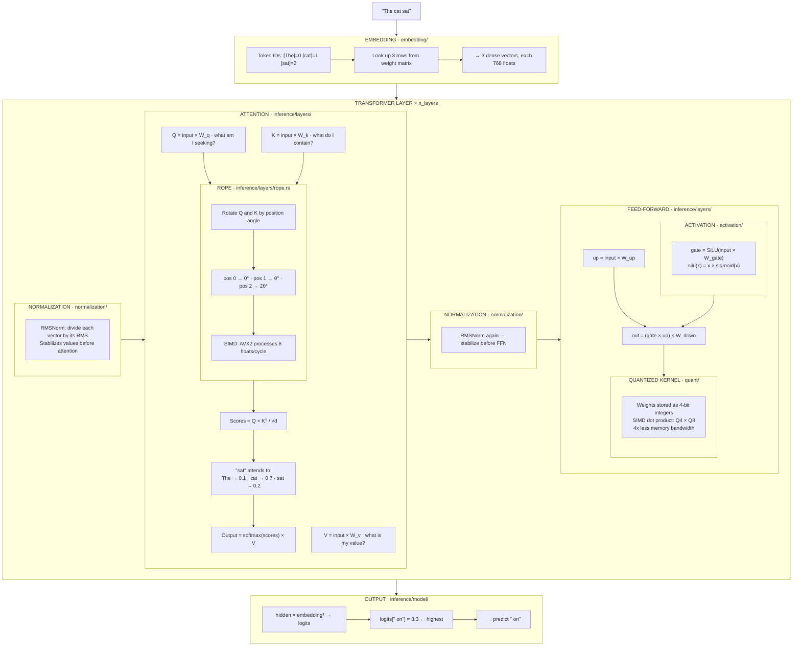
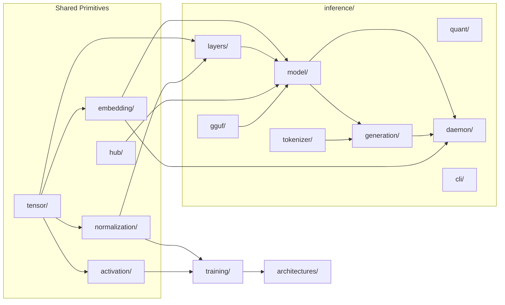

# Inference Pipeline — How Text Generation Works

This guide traces a single prediction through the inference stack, mapping each step to the crate that implements it.

## Input → Output

Given input `"The cat sat"`, the model predicts the next token `" on"`.

## Pipeline

## Layer Count

Each model repeats the transformer layer block a fixed number of times:

| Model | Layers | Parameters |
|-------|--------|------------|
| GPT-2 small | 12 | 124M |
| Gemma 3 1B | 26 | 1B |
| Llama 2 7B | 32 | 7B |
| Mixtral 8x7B | 32 | 47B |

The layer count comes from `ModelConfig.n_layers`, read from the model's config at load time.

## Crate Mapping

## Crate Reference

| Step | Crate | What it does |
|------|-------|-------------|
| Token → vector | `embedding/` | Row lookup from weight matrix |
| Normalize | `normalization/` | RMSNorm / LayerNorm math |
| Attention | `inference/layers/` | Q/K/V projection, scores, weighted sum |
| Position encoding | `inference/layers/` | RoPE with SIMD (AVX2/NEON) |
| Activation | `activation/` | SiLU, GELU pointwise nonlinearity |
| Quantized matmul | `inference/quant/` | SIMD dot products on 4/8-bit weights |
| KV cache | `inference/layers/` | Pre-allocated key/value buffers for decoding |
| Model assembly | `inference/model/` | Composes layers into LlmModel |
| Text generation | `inference/generation/` | Token-by-token loop, sampling, streaming |
| HTTP API | `inference/daemon/` | Serves /v1/completions and /v1/embeddings |
| Weight loading | `hub/` | Downloads from HuggingFace, loads SafeTensors |
| GGUF loading | `inference/gguf/` | Parses GGUF format model files |
| Tokenization | `inference/tokenizer/` | Text ↔ token IDs (BPE, SentencePiece, HF) |
