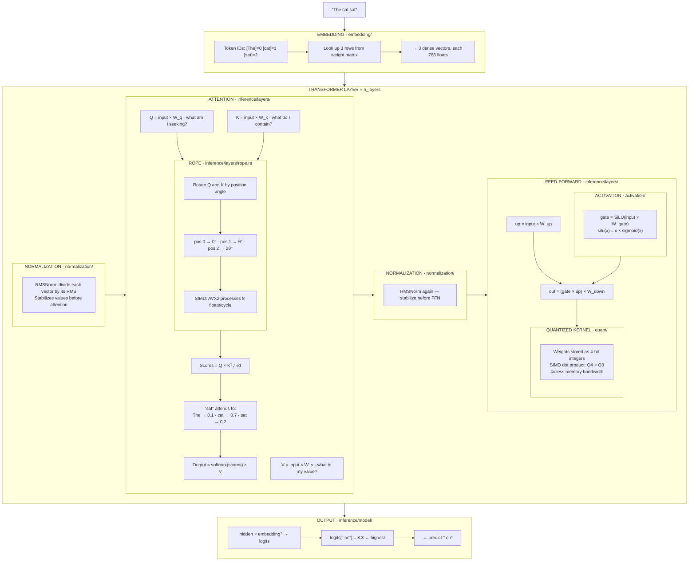
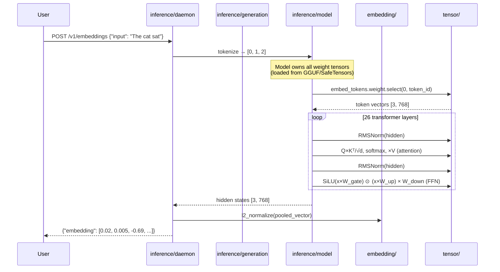
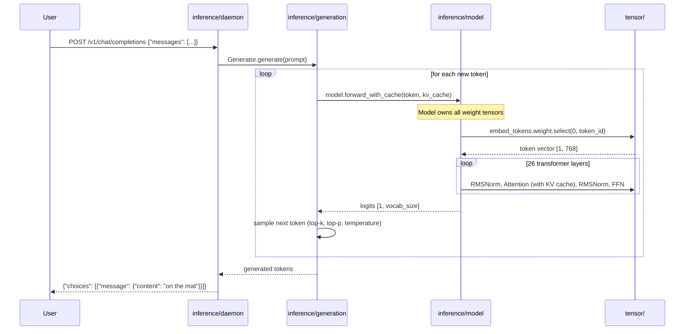
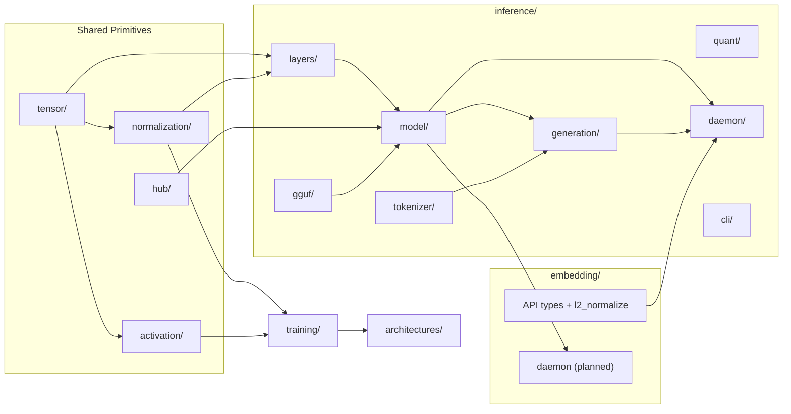
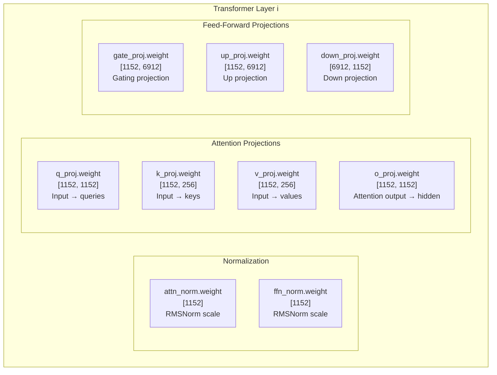

# Inference Pipeline — How Text Generation Works

This guide traces a single prediction through the inference stack, mapping each step to the crate that implements it, the math behind it, and alternative approaches.

## Input → Output

Given input `"The cat sat"`, the model predicts the next token `" on"`.

## Pipeline



## Component Detail

### 1. Embedding

Converts discrete token IDs into continuous vectors by looking up rows in a learned weight matrix.

**Math:** `embed(i) = W[i, :]` where `W ∈ R^{vocab × d_model}`

| What we use | Alternatives | Trade-off |
|-------------|-------------|-----------|
| Learned embedding table | One-hot encoding | One-hot is sparse and high-dimensional (vocab-sized) |
| | Hash embeddings | Lower memory, but lossy — collisions degrade quality |
| | Byte-level embedding | No tokenizer needed, but sequences are longer |

**Crate:** `embedding/`

---

### 2. Normalization

Stabilizes activations by normalizing each vector to consistent scale before attention and FFN.

**RMSNorm math:**

```
RMSNorm(x) = x / RMS(x) × γ
RMS(x) = √(mean(x²) + ε)
```

**LayerNorm math:**

```
LayerNorm(x) = (x - μ) / √(σ² + ε) × γ + β
μ = mean(x),  σ² = var(x)
```

| What we use | Alternatives | Trade-off |
|-------------|-------------|-----------|
| RMSNorm (Llama, Gemma) | LayerNorm (GPT-2, BERT) | RMSNorm is faster — skips mean subtraction and bias |
| | BatchNorm | Requires batch statistics — unsuitable for autoregressive generation |
| | GroupNorm | Splits channels into groups — used in vision, not common in LLMs |
| Pre-norm (norm before attention) | Post-norm (norm after attention) | Pre-norm trains more stably; post-norm was original Transformer design |

**Crate:** `normalization/`

---

### 3. Attention

Determines how much each token should attend to every other token, then produces a weighted sum of their values.

**Math:**

```
Attention(Q, K, V) = softmax(Q × Kᵀ / √d_k) × V

Q = input × W_q    (queries)
K = input × W_k    (keys)
V = input × W_v    (values)
```

**Softmax:** `softmax(z_i) = e^{z_i} / Σ_j e^{z_j}` — converts scores to probabilities summing to 1.

**Multi-head:** Split Q, K, V into `n_heads` parallel attention computations, each with `d_k = d_model / n_heads`, then concatenate results. Allows the model to attend to different aspects simultaneously.

**Grouped Query Attention (GQA):** Use fewer K/V heads than Q heads (e.g., 8 KV heads for 32 Q heads). Reduces KV cache memory by 4x with minimal quality loss.

| What we use | Alternatives | Trade-off |
|-------------|-------------|-----------|
| Multi-Head Attention (MHA) | Single-head attention | MHA captures multiple relationship types in parallel |
| Grouped Query Attention (GQA) | Multi-Query Attention (MQA) | GQA balances memory savings vs quality; MQA is more aggressive (1 KV head) |
| Scaled dot-product | Additive attention (Bahdanau) | Dot-product is faster (matrix multiply vs learned layer) |
| Full causal attention | Sliding window (Mistral, Gemma) | Sliding window limits context but reduces O(n²) cost |
| | Flash Attention | Fuses softmax + matmul in one GPU kernel — we're CPU-only |
| | Linear attention | O(n) instead of O(n²), but lower quality |

**Crate:** `inference/layers/attention.rs`

---

### 4. Position Encoding (RoPE)

Encodes token position into query/key vectors so attention can distinguish token order. Without position encoding, "cat sat" and "sat cat" would produce identical attention scores.

**Math:**

```
RoPE applies a rotation matrix R(θ) to pairs of dimensions:

R(θ) = [cos(θ)  -sin(θ)]
       [sin(θ)   cos(θ)]

θ_i = position × base^{-2i/d}     (base = 10000 by default)
```

Each dimension pair rotates at a different frequency — low dimensions rotate slowly (capture long-range), high dimensions rotate fast (capture local).

| What we use | Alternatives | Trade-off |
|-------------|-------------|-----------|
| RoPE (Llama, Gemma) | Learned positional embedding (GPT-2) | RoPE generalizes to unseen sequence lengths; learned is fixed |
| | Sinusoidal (original Transformer) | Fixed like RoPE but doesn't encode relative position as naturally |
| | ALiBi (BLOOM) | Adds linear bias to attention scores instead of modifying Q/K — simpler |
| | NoPE (no position encoding) | Some models work without explicit position — position leaks through causal mask |
| AVX2 SIMD implementation | Scalar loop | SIMD: 8 floats/cycle. Scalar: 1 float/cycle. Same result. |
| NEON (ARM fallback) | Scalar fallback | 4 floats/cycle on ARM. Automatic dispatch at runtime. |

**Crate:** `inference/layers/rope.rs`

---

### 5. Activation Function

Introduces nonlinearity between linear projections. Without activations, stacking linear layers collapses to a single linear transformation.

**SiLU math:** `SiLU(x) = x × σ(x) = x / (1 + e^{-x})`

**GELU math:** `GELU(x) = 0.5 × x × (1 + tanh(√(2/π) × (x + 0.044715x³)))`

| What we use | Alternatives | Trade-off |
|-------------|-------------|-----------|
| SiLU / Swish (Llama, Gemma) | GELU (GPT-2, BERT) | SiLU is smoother; GELU is standard in encoder models |
| | ReLU | Simpler (`max(0,x)`) but "dying ReLU" problem — neurons go permanently zero |
| | Leaky ReLU | Fixes dying ReLU with small negative slope, but not used in modern LLMs |
| SwiGLU (gated SiLU) | Standard MLP | SwiGLU: `SiLU(xW_gate) × (xW_up)` — gating improves quality at cost of extra projection |
| GeGLU (gated GELU) | SwiGLU | Same gating idea with GELU instead of SiLU |

**Crate:** `activation/`

---

### 6. Feed-Forward Network (MLP)

Two-layer network that transforms each token independently. The "thinking" step between attention layers.

**Standard MLP math:**

```
FFN(x) = activation(x × W_up) × W_down
```

**Gated MLP (SwiGLU) math:**

```
FFN(x) = (SiLU(x × W_gate) ⊙ (x × W_up)) × W_down
```

Where `⊙` is element-wise multiplication. The gate controls information flow.

| What we use | Alternatives | Trade-off |
|-------------|-------------|-----------|
| SwiGLU gated MLP (Llama, Gemma) | Standard 2-layer MLP (GPT-2) | Gating improves quality; costs one extra projection |
| | Mixture of Experts (Mixtral) | Routes each token to top-k experts — more capacity per parameter |
| Fused gate+up projection | Separate gate and up matmuls | Fusing halves kernel dispatch overhead during decoding |

**Crate:** `inference/layers/feed_forward.rs`

---

### 7. Quantization

Compresses weight matrices from 32-bit floats to 4-bit or 8-bit integers, reducing memory bandwidth.

**Q8_0 math:**

```
scale = max(|block|) / 127
quantized[i] = round(float[i] / scale)
dequantized[i] = quantized[i] × scale
```

**Q4_0 math:** Same principle, but 4-bit range [-8, 7] with 32-element blocks.

| What we use | Alternatives | Trade-off |
|-------------|-------------|-----------|
| Q8_0 (8-bit, per-block scale) | FP32 | 4x less memory, ~0% quality loss |
| Q4_0 (4-bit, per-block scale) | Q8_0 | 8x less memory, small quality loss |
| Q4_1 (4-bit, scale + min) | Q4_0 | Better accuracy for asymmetric distributions, slightly larger |
| Block quantization (32 elements) | Per-tensor quantization | Per-block adapts to local value ranges — much better quality |
| SIMD dot product (AVX2/NEON) | Scalar dequant + matmul | SIMD operates on packed integers directly — avoids dequant overhead |
| | GPTQ, AWQ | Calibration-based quantization — better quality but requires calibration data |
| | FP16 / BF16 | 2x compression, no quantization error, but needs hardware support |

**Crate:** `inference/quant/` (kernels), `inference/quantize/` (pipeline)

---

### 8. KV Cache

Pre-allocates and reuses key/value tensors across decoding steps so each new token doesn't recompute attention over the entire history.

**Math:** At step `t`, instead of recomputing K and V for all `t` tokens:

```
K_cache[t] = new_K    (append one row)
V_cache[t] = new_V

Attention uses K_cache[0..t] and V_cache[0..t]
```

| What we use | Alternatives | Trade-off |
|-------------|-------------|-----------|
| Pre-allocated contiguous buffer | Dynamic Vec growth | Pre-alloc avoids reallocation during generation |
| Per-layer cache | Shared cache (Gemma 4 KV sharing) | Sharing reduces memory; per-layer is simpler |
| Full history | Sliding window cache | Sliding window bounds memory to window size |
| | Paged attention (vLLM) | Virtual memory paging for cache — enables batching, we don't batch |

**Crate:** `inference/layers/kv_cache.rs`

---

### 9. Output Projection

Projects the final hidden state to vocabulary-sized logits, then selects the next token.

**Math:**

```
logits = hidden × W_embed^T        (weight tying — reuses embedding matrix)
p(token) = softmax(logits)          (convert to probabilities)
next_token = sample(p)              (greedy, top-k, top-p, temperature)
```

| What we use | Alternatives | Trade-off |
|-------------|-------------|-----------|
| Weight tying (share embed/output) | Separate output projection | Tying halves the parameter count for large vocabs |
| Top-k sampling | Greedy (argmax) | Top-k adds diversity; greedy is deterministic but repetitive |
| Top-p (nucleus) sampling | Top-k | Top-p adapts the candidate set size to the distribution shape |
| Temperature scaling | No scaling | `logits / T`: T>1 flattens (creative), T<1 sharpens (focused) |
| Repetition penalty | No penalty | Penalizes already-generated tokens to reduce loops |

**Crate:** `inference/generation/` (sampling), `inference/model/` (projection)

---

## Layer Count

Each model repeats the transformer layer block a fixed number of times:

| Model | Layers | Parameters | Normalization | Attention | Activation | Position |
|-------|--------|------------|---------------|-----------|------------|----------|
| GPT-2 small | 12 | 124M | LayerNorm | MHA | GELU | Learned |
| Gemma 3 1B | 26 | 1B | RMSNorm | GQA + sliding window | SwiGLU | RoPE |
| Llama 2 7B | 32 | 7B | RMSNorm | GQA | SwiGLU | RoPE |
| Mixtral 8x7B | 32 | 47B | RMSNorm | GQA | SwiGLU + MoE | RoPE |
| nomic-embed-text | 12 | 137M | LayerNorm | MHA (bidirectional) | GELU | RoPE |

The layer count comes from `ModelConfig.n_layers`, read from the model's config at load time.

## Data Flow: Who Owns What

The model owns its weight tensors. External crates ask the model for results — they don't reach into the model's internals.





### Key principle

The model is the single owner of weight tensors. It loads them from disk, stores them, and uses them for computation. External crates interact through the model's public API:

- `model.forward(input_ids)` → logits
- `model.forward_with_cache(input_ids, cache)` → logits (autoregressive)
- `model.embed(input_ids, strategy)` → pooled embedding vector
- `model.encode(input_ids)` → hidden states

No crate reaches into the model to access weight tensors directly. The embedding weight lookup, attention projections, FFN computations — all happen inside the model. `embedding/` provides the API types and normalization for the HTTP endpoint, not the lookup itself.

## Crate Dependency Graph



## Crate Reference

| Step | Crate | What it does |
|------|-------|-------------|
| Token → vector | `embedding/` | Row lookup from weight matrix |
| Normalize | `normalization/` | RMSNorm / LayerNorm math |
| Attention | `inference/layers/` | Q/K/V projection, scores, weighted sum |
| Position encoding | `inference/layers/` | RoPE with SIMD (AVX2/NEON) |
| Activation | `activation/` | SiLU, GELU pointwise nonlinearity |
| Quantized matmul | `inference/quant/` | SIMD dot products on 4/8-bit weights |
| KV cache | `inference/layers/` | Pre-allocated key/value buffers for decoding |
| Model assembly | `inference/model/` | Composes layers into LlmModel |
| Text generation | `inference/generation/` | Token-by-token loop, sampling, streaming |
| HTTP API | `inference/daemon/` | Serves /v1/completions and /v1/embeddings |
| Weight loading | `hub/` | Downloads from HuggingFace, loads SafeTensors |
| GGUF loading | `inference/gguf/` | Parses GGUF format model files |
| Tokenization | `inference/tokenizer/` | Text to token IDs (BPE, SentencePiece, HF) |

---

## Appendix: Weight Tensors

Weight tensors are learned parameter matrices stored in model files. During training, an optimizer adjusts these values to minimize loss. During inference, they are fixed — loaded from disk and used as-is.

### What is a weight tensor?

A multi-dimensional array of floating-point numbers that the model multiplies with or indexes into during computation. Every layer has them. They are the model's knowledge — without them, the architecture is just a sequence of empty operations.

### Weight tensors in a single transformer layer

For one layer of Gemma 3 1B (`d_model=1152`, `d_kv=256`, `hidden_dim=6912`):



### Complete weight inventory (Gemma 3 1B)

| Weight | Shape | Count | Purpose |
|--------|-------|-------|---------|
| `embed_tokens.weight` | [262144, 1152] | 1 | Token ID → vector lookup |
| `layers.{i}.attn_norm.weight` | [1152] | 26 | RMSNorm before attention |
| `layers.{i}.q_proj.weight` | [1152, 1152] | 26 | Query projection |
| `layers.{i}.k_proj.weight` | [1152, 256] | 26 | Key projection |
| `layers.{i}.v_proj.weight` | [1152, 256] | 26 | Value projection |
| `layers.{i}.o_proj.weight` | [1152, 1152] | 26 | Output projection |
| `layers.{i}.ffn_norm.weight` | [1152] | 26 | RMSNorm before FFN |
| `layers.{i}.gate_proj.weight` | [1152, 6912] | 26 | FFN gate |
| `layers.{i}.up_proj.weight` | [1152, 6912] | 26 | FFN up |
| `layers.{i}.down_proj.weight` | [6912, 1152] | 26 | FFN down |
| `norm.weight` | [1152] | 1 | Final RMSNorm |
| `lm_head.weight` | [262144, 1152] | 1 | Hidden → vocab logits (often tied to embed_tokens) |

**Total:** 1 embedding + (26 × 10 per-layer) + 1 final norm + 1 output head = **263 weight tensors**

### How weights are stored

| Format | Source | How it works |
|--------|--------|-------------|
| SafeTensors | HuggingFace Hub | JSON header + raw float arrays, memory-mappable |
| GGUF | llama.cpp ecosystem | Binary header + quantized blocks (Q4, Q8), single file |

Both formats map weight names to tensor data. The model loader reads the format, remaps HuggingFace weight names to internal names (via `WeightMap`), and constructs `LlmModel` from the tensors.

### Where weights live in the codebase

```
hub/           → downloads model files from HuggingFace
inference/gguf/      → parses GGUF format
inference/model/     → loads weights into LlmModel (owns them)
tensor/        → the Tensor type that holds the data
```

The model is the single owner. No other crate accesses weight tensors directly.
